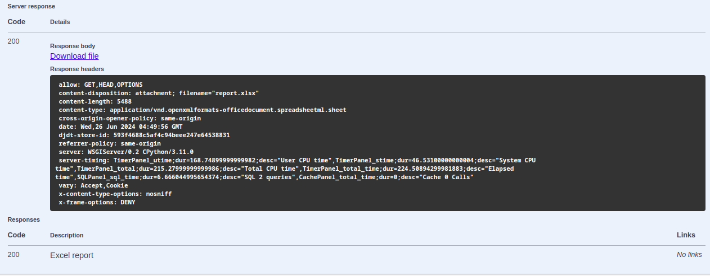

## Создать ```.env``` файл в конрне проекта.

    SITE_HOST=localhost
    DEBUG=True
    API_DOCS_ENABLE=True
    
    # Если есть mkcert, то можете прокинуть свои локальные сертификаты в nginx,
    # тем самым подняв https соединение на локалке. Если не хочется этим заниматься,
    # то поставьте переменную TLS_MODE=off, и заходите на проект по http://localhost:8000
    TLS_MODE=off
    TLS_MODE_SECOND=off
    TLS_CERTIFICATE=.certs/localhost.pem
    TLS_CERTIFICATE_KEY=.certs/localhost-key.pem
    
    SECRET_KEY=my_very_sercet_key
    
    POSTGRES_PASSWORD=12345
    POSTGRES_PORT=5432
    POSTGRES_NAME=postgres
    POSTGRES_USER=postgres

## Локальный запуск проекта
```shell
docker-compose build
```
```shell
docker-compose -f docker-compose.yml -f docker-compose.override.yml up --remove-orphans -d --build
```

## SWAGGER
```
http://0.0.0.0:8000/api/docs
```

## Включение выгрузки из ```xlsx``` файла
```shell
make start_import
```

## Эндпоинты

### http://0.0.0.0:8000/api/report/
```
curl -X 'GET' \
  'http://0.0.0.0:8000/api/report/?end_date=2023-08-22T09%3A43%3A50&start_date=2023-08-22T01%3A32%3A30' \
  -H 'accept: application/json'
```
#### GET - Возвращает список заявок с pagenumber пагинацией
#### Параметры: end_date, start_date - фильтрация по дате и времени для заявок в формате "%m-%D-%YT%H:%M" (пример выше)

### http://0.0.0.0:8000/api/report/generate_report_by_excel/
```
curl -X 'GET' \
  'http://0.0.0.0:8000/api/report/generate_report_by_excel/?end_date=2023-08-22T09%3A43%3A50&start_date=2023-08-22T01%3A32%3A30' \
  -H 'accept: */*'
```
#### GET - Возвращает excel файл с отчетом
#### Параметры: те же самые параметры end_date, start_date - влияет на данные в отчете
